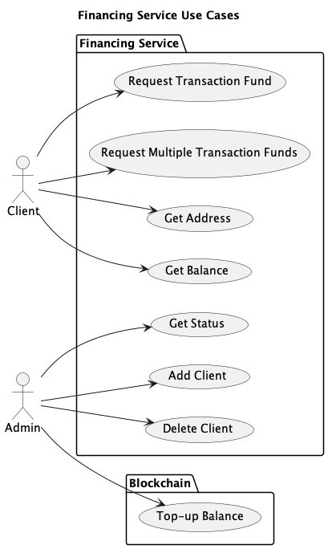
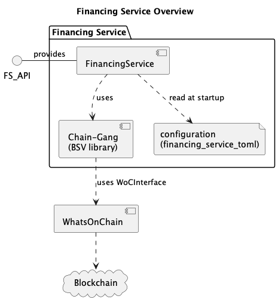

# Financing Service - Rust

The Financing Service (FS) creates Bitcoin SV transaction outpoint(s) of the correct satoshi value to fund client transactions, on request by a client application.

The FS is a component that can be used in different applications. Initially these will be Research applications. The component should be flexible, robust, clearly documented and maintainable, so that it is capable of supporting nChain release products.

The initial concept of this service was captured in the document:
https://docs.google.com/document/d/159T_RDgf8CnSq3Kd4PaYgfw9OUrX-kwwdZw4qEe4iP0/edit?usp=sharing


The FS is designed to be as simple as possible, in that light it:

* One FS can serve multiple clients.
* FS provides REST API for clients to interact with.
* FS supports the dynamic addition and removal of clients from the sytem (via REST API).

* FS can provide any satoshi amount (subject to sufficent funds).
* FS can provide any number of outpoints, in any number of transactions.

* FS only accesses the funding key required to sign the transaction that provides the funds the client wishes to spend.
* FS does not access the client's key, instead the client provides the locking script (script_pubkey).

* FS (currently) uses WhatsOnChain interface to access the blockchain.
* FS is stateless, that is to say it determines its state by reading the blockchain, it stores no state.
* FS is configurable, it reads its configuration on startup.

* FS does not cache funding transactions. That is a task better performed by the requesting application, which has much better oversight to determine how many funding transactions to cache, and when to request them.

* FS is written in Rust.
* FS build dependencies are all freely avalible open-source Rust crates.

* FS does not support Hierarchical Deterministic (HD) Keys (BIP-32).
* FS does not provide security in of itself. That is to say there is nothing insecure about the design. However we have avoided second guessing security measures which would be better provided by the deployed system VPS/Firewalls/Access Controls etc.

## Use cases



Diagram 1 - Financing Service Use Cases

The Financing Service Client use cases are:
* `Request Transaction Fund` - the FS receives a request for a satoshi value, it creates a funding transaction and provides the outpoint to the requestor so that they can fund their transaction.
* `Request Transaction Funds` - the FS receives a request for multiple outpoints for  a satoshi value, it creates a funding transaction and returns the outpoints.
* `Get Balance` - the FS returns the current level of funding associated with a particular client.
* `Get Address` - the FS returns the address of particular client, this can be used for providing additional funds.

The Financing Service Admin use cases are:
* `Get Status` - the FS will return the current status of the component.
* `Add Client` - Dynamically add the client whist the service is running.
* `Delete Client` - Dynamically delete the client whist the service is running.
* `Top-up Balance` - The Admin will provide a funding transaction to increase the satoshi that the FS can use for funding. This is done outside the Financing Service.


## Overview



Diagram 2 - Financing Service Overview

As shown in diagram 1 the FS provides an interface that the other application components interface with and uses the blockchain to create the funding transaction outpoints.

The service reads its configuration on startup.

The service uses the `chain-gang` library's WoCInterface to interact with the BSV blockchain.


## Geting Started

The project can either be run as an executable or as a docker container (smallish 100MB).


## Docker
Encapsulating the service in Docker removes the need to install the project dependencies on the host machine.
Only Docker is required to build and run the service.
### 1) Build The Docker Image
To build the docker image associated with the service run the following comand in the project directory.
```bash
./build.sh
```
This builds the Docker image `financing-service-rust`.
### 2) To Run the Image
The to start the Docker container:
```bash
./run.sh
```
This will provide a REST API at http://localhost:8080


## To Build the Service
The service is developed in Rust.

The best way to install Rust is to use `rustup`, see https://www.rust-lang.org/tools/install

To build:
```bash
cargo build
```

## To Run the Service
To run:
```bash
cargo run
```


## Supported endpoints
For details of the REST API endpoints provided by this service see [here](docs/SupportedEndpoints.md)

## Locking scripts
For details on generating locking scripts for the `fund` call see [here](docs/LockingScripts.md)

