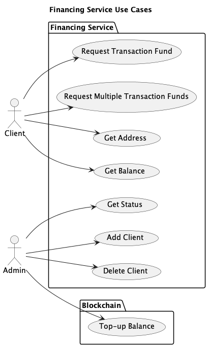
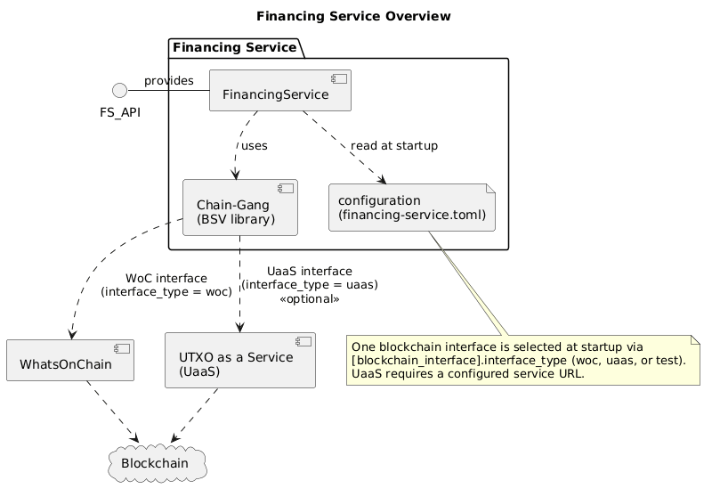

# Financing Service - Rust

The Financing Service (FS) creates Bitcoin SV transaction outpoint(s) of the correct satoshi value to fund client transactions, on request by a client application.

The FS is a component that can be used in different applications. Initially these will be Research applications. The component should be flexible, robust, clearly documented and maintainable, so that it is capable of supporting nChain release products.

The initial concept of this service was captured in the document:
https://docs.google.com/document/d/159T_RDgf8CnSq3Kd4PaYgfw9OUrX-kwwdZw4qEe4iP0/edit?usp=sharing


The FS is designed to be as simple as possible, in that light it:

* One FS can serve multiple clients.
* FS provides REST API for clients to interact with.
* FS supports the dynamic addition and removal of clients from the system (via REST API).

* FS can provide any satoshi amount (subject to sufficient funds).
* FS can provide any number of outpoints, in any number of transactions.

* FS only accesses the funding key required to sign the transaction that provides the funds the client wishes to spend.
* FS does not access the client's key, instead the client provides the locking script (script_pubkey).

* FS uses WhatsOnChain or UTXO as a Service (UaaS) interfaces to access the blockchain. Both reach mainnet, testnet and STN; neither reaches regtest. See [which interface reaches which network](docs/Configuration.md#which-interface-reaches-which-network).
* FS maintains an in-memory UTXO cache per client, refreshed periodically from the blockchain and before funding and balance requests. Clients added at runtime are persisted to a dynamic config file.
* FS is configurable; it reads its configuration on startup.

* FS does not cache funding transactions for client applications. That is a task better performed by the requesting application, which has much better oversight to determine how many funding transactions to cache, and when to request them.

* FS is written in Rust.
* FS build dependencies are all freely available open-source Rust crates.

* FS does not support Hierarchical Deterministic (HD) Keys (BIP-32).
* FS supports optional per-client API key authentication and an optional admin key for `POST /client`. Clients without an `api_key` rely on network isolation (firewalls, private networks, reverse proxies). See [Configuration](docs/Configuration.md) and [Supported endpoints](docs/SupportedEndpoints.md).
* FS supports secret references (`env:VAR`), environment variable overrides, and `wif_env` / `api_key_env` when adding clients at runtime. See [Configuration](docs/Configuration.md#secret-management).
* FS supports optional per-IP HTTP rate limiting (disabled by default). See [Configuration](docs/Configuration.md#rate-limiting).
* FS supports optional OpenTelemetry trace export via OTLP (disabled by default). Each HTTP request creates a span; traces include resource metadata and request fields but not secrets or request bodies. See [Configuration](docs/Configuration.md#telemetry).

## Use cases



Diagram 1 - Financing Service Use Cases

The Financing Service Client use cases are:
* `Request Transaction Fund` - the FS receives a request for a satoshi value, it creates a funding transaction and provides the outpoint to the requestor so that they can fund their transaction.
* `Request Transaction Funds` - the FS receives a request for multiple outpoints for  a satoshi value, it creates a funding transaction and returns the outpoints.
* `Get Balance` - the FS returns the current level of funding associated with a particular client.
* `Get Address` - the FS returns the address of particular client, this can be used for providing additional funds.

The Financing Service Admin use cases are:
* `Get Status` - the FS will return the current status of the component.
* `Health Check` - the FS exposes a liveness endpoint for container deployments.
* `Add Client` - Dynamically add the client while the service is running.
* `Delete Client` - Dynamically delete the client while the service is running.
* `Top-up Balance` - The Admin will provide a funding transaction to increase the satoshi that the FS can use for funding. This is done outside the Financing Service.


## Overview



Diagram 2 - Financing Service Overview

As shown in diagram 1 the FS provides an interface that the other application components interface with and uses the blockchain to create the funding transaction outpoints.

The service reads its configuration on startup, maintains per-client wallet state in memory, and persists runtime-added clients to disk.

Before returning a balance or building a funding transaction, the service refreshes UTXO state from the blockchain. Concurrent fund requests for the same client use read-only planning under a shared lock and commit UTXO updates only after a transaction is broadcast successfully.

The service uses the `chain-gang` library to interact with the BSV blockchain via a configurable interface: WhatsOnChain (WoC) by default in sample config, or optionally UTXO as a Service (UaaS).


## Getting Started

The project can either be run as an executable or as a docker container (smallish 100MB).


## Docker
Encapsulating the service in Docker removes the need to install the project dependencies on the host machine.
Only Docker is required to build and run the service.
### 1) Build The Docker Image
To build the docker image associated with the service run the following comand in the project directory.
```bash
./build.sh
```
This builds the Docker image `financing-service-rust`. The image includes a health check against `GET /health`.
### 2) To Run the Image
To start the Docker container:
```bash
./run.sh
```
This will provide a REST API at http://localhost:8080


## To Build the Service
The service is developed in Rust.

The best way to install Rust is to use `rustup`, see https://www.rust-lang.org/tools/install

To build:
```bash
cargo build
```

## To Run the Service
To run locally:

```bash
cargo run
```

Run tests, formatting, and lint checks:

```bash
cargo test
cargo fmt --all -- --check
cargo clippy -- -D warnings
```

These checks also run in GitHub Actions on push and pull request.

## Building and Publishing Docker Images

This project creates the Docker image: `financing-service` which is published to Docker Hub.  This makes it accessible for use by other projects and applications within the ecosystem.

To build and publish the image to Docker Hub, run the following command:
```
./multi-build.sh
```

**Requirements**

- **Docker Buildx:** The script requires Docker's Buildx extension to be set as the active builder. Ensure Buildx is properly installed and selected as the current Docker engine. For help, see [Docker Buildx](https://docs.docker.com/build/builders/)  

- **Publishing Permissions:** Only members of the `rndprototyping` team within the `nChain` Docker Hub organisation are authorised to publish images with the appropriate tags. Ensure you are logged in with the necessary permissions before running the script, else this will fail.


## Supported endpoints
For details of the REST API endpoints provided by this service see [here](docs/SupportedEndpoints.md)

## Configuration
For service and client configuration, including per-client `api_key` authentication and optional OpenTelemetry, see [here](docs/Configuration.md)

## Project status
For architecture, implementation status, and known limitations, see [Project.md](docs/Project.md)

## System requirements
For formal requirements and how each is verified (automated tests, CI, manual checks), see [SystemRequirements.md](docs/SystemRequirements.md)

## Locking scripts
For details on generating locking scripts for the `fund` call see [here](docs/LockingScripts.md)

