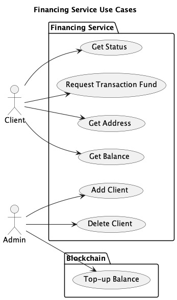

# Financing Service - Rust

This is a version of the Financing Service written in Rust.

The Financing Service (FS) creates Bitcoin SV transaction outpoint(s) of the correct satoshi value to fund particular transactions, on request.

The FS is a component that can be used in different applications. Initially these will be R&D applications. The component should be flexible, robust, clearly documented and maintainable, so that it is capable of supporting nChain release products.


Diagram 1 - Financing Service Overview

As shown in diagram 1 the FS provides an interface that the other application components interface with and uses the blockchain to create the funding transaction outpoints.

A overview of the project can be found:
https://docs.google.com/document/d/159T_RDgf8CnSq3Kd4PaYgfw9OUrX-kwwdZw4qEe4iP0/edit?usp=sharing


## Use cases



Diagram 2 - Financing Service Use Cases

The Financing Service use cases are:
* `Request Transaction Fund` - the FS receives a request for a satoshi value, it creates a funding transaction and provides the outpoint to the requestor so that they can fund their transaction.
* `Request Transaction Funds` - the FS receives a request for multiple outpoints for  a satoshi value, it creates a funding transaction and returns the outpoints.
* `Get Balance` - the FS returns the current level of funding associated with a particular client.
`Top-up Balance` - The Admin will provide a funding transaction to increase the satoshi that the FS can use for funding.
* `Get Status` - the FS will return the current status of the component.


## Geting Started

To download the project from Bitbucket, first clone the project, then update the submodules.
The financing service has `chain-gang` as a submodule.
```bash
git clone ssh://git@bitbucket.stressedsharks.com:8443/sdl/financing-service-rust.git
cd financing-service-rust
git submodule init
git submodule update
```

Install the development dependencies as detailed here [here](docs/Development.md) and configure database using instructions [here](Database.md). 


## To Build the Service
The service is developed in Rust.
The best way to install Rust is to use `rustup`, see https://www.rust-lang.org/tools/install

To build:
```bash
cargo build
```

## To Run the Service
To run:
```bash
cargo run
```
## Supported endpoints
The service provides the following endpoints:
### Service status
/status

Returns a JSON service status report
```JSON
curl http://127.0.0.1:8080/status
{
    "blockchain_status": "Connected",
    "blockchain_update_time": "2022-10-12 10:20:41",
    "clients":[
        {"client_id": "id1", "confirmed":9565721, "unconfirmed": 0},
        {"client_id": "id2", "confirmed":4713, "unconfirmed": 0}
    ]
}
```

### Client Balance
/balance/{client_id}
```JSON
curl http://127.0.0.1:8080/balance/id1
{
    "status": "Success",
    "Balance": {"client_id": "id1", "confirmed":9565721, "unconfirmed": 0}
}
```

### Fund Transactions
/fund/{client_id}/{satoshi}/{no_of_outpoints}/{multiple_tx}/{locking_script}
```JSON
curl -X POST http://127.0.0.1:8080/fund/id1/123/1/false/0000
{
    "status": "Success",
    "outpoints": [
        {
            "hash": "e6d71bb86e514c75921a032a0c7783bc1fab4b1b19fd675cfb3f0b918a3460a8",
            "index": 1
        }
    ]
}
```
